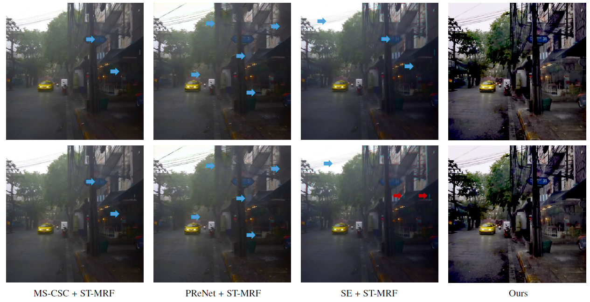

## Learning to Remove Rain in Video with Self-Supervision (In Submission)

[Wenhan Yang](https://flyywh.github.io/index.html), 
[Robby T. Tan](https://tanrobby.github.io/pub.html),
[Shiqi Wang](https://www.cs.cityu.edu.hk/~shiqwang/),
and [Jiaying Liu](http://www.icst.pku.edu.cn/struct/people/liujiaying.html) 

[[Paper Link]](http://39.96.165.147/Pub%20Files/2021/ywh_pami21.pdf)
[[Project Page]](https://github.com/flyywh/CVPR-2020-Self-Rain-Removal-Journal)

### Abstract

Unlike existing video-deraining methods, this paper presents a self-learning method to remove both rain streaks and rain accumulation without using any ground-truth clean images in model training. The main idea is based on assumptions that (1) adjacent clean frames can be aligned or warped from one frame to another frame, and (2) rain streaks are distributed randomly in the temporal domain. Based on these assumptions, we construct an augmented Self-Learned Deraining Network (SLDNet+) to remove rain streaks by utilizing temporal correlation, consistency, and rain-related priors. Exploiting the temporal correlation, our SLDNet+ takes rain degraded adjacent frames as its input, aligns them, and learns to predict the clean version of the current frame. It then warps the estimated clean current frame to generate its clean adjacent frames, and enforce the temporal consistency among the generated frames by designing a loss that is robust to noisy images. Our SLDNet+ architecture is further augmented with two sub-tasks, i.e. motion estimation and rain region detection, which are optimized jointly. Subsequently, it applies a distillation process by replacing the current rain frame with adjacent frames to improve the model’s capacities to preserve details and adapt more diverse rain streaks in real scenes. Furthermore, our methods employ a new non-local video rain accumulation removal method, which estimates the accumulation-lines from the whole video clip and offers better color constancy and temporal smoothness also without using any synthetic data in the training. Extensive experiments show the effectiveness of our approach, which provides better results in both quantitative and qualitative evaluations. The source code will be made publicly available at: https://github.com/flyywh/CVPR-2020-Self-Rain-Removal-Journal.

 

## Prerequisites
(TBD)

## Installation
(TBD)

## Contact
If you have questions, you can contact `yangwenhan@pku.edu.cn`.
